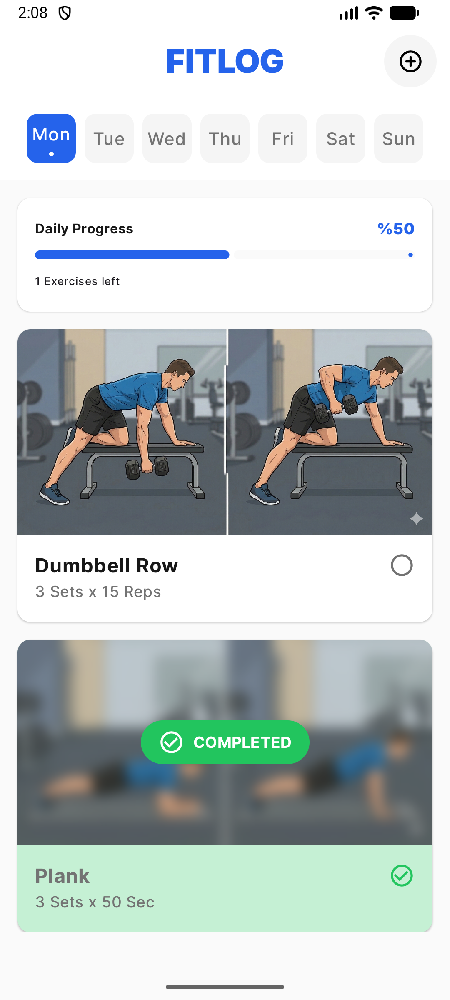
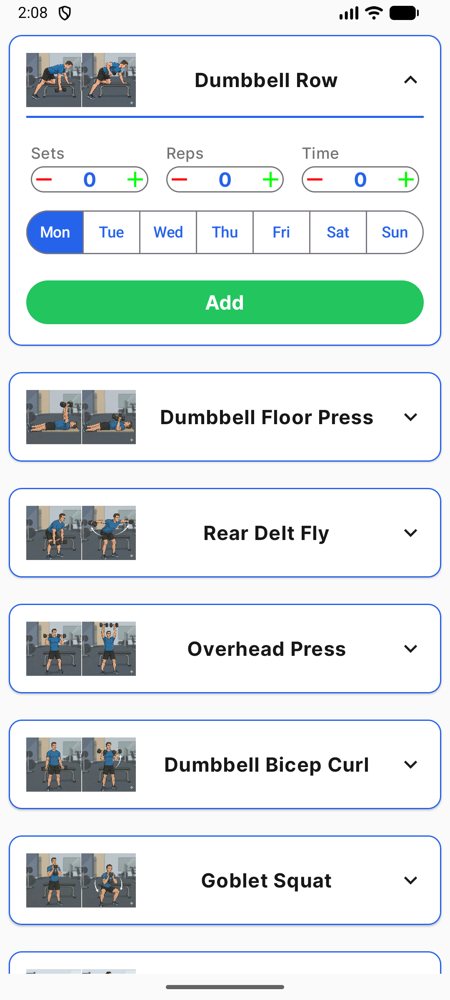

# 🏋️‍♂️ FitLog - Modern Workout Tracker

**FitLog** is a high-performance, minimal, and fully reactive workout management application built with modern Android development standards. It allows users to plan their daily exercises, track progress in real-time, and manage their fitness routines with an intuitive UI.

## ✨ Key Features

- 📊 **Dynamic Progress Tracking:** A real-time progress card that updates instantly as you complete exercises.
- 📅 **Weekly Planning:** Organize and filter workouts based on the days of the week.
- 📂 **Exercise Catalog:** Pre-loaded exercise library fetched from local JSON assets.
- 🧹 **Modern Interactions:** Material 3 `Swipe-to-Dismiss` functionality to easily remove exercises from your daily plan.
- ⚡ **Reactive UI:** Powered by Room Database and Kotlin Flow for a seamless "single source of truth" experience.

## 🛠 Tech Stack

- **UI:** [Jetpack Compose](https://developer.android.com/jetpack/compose) (Material 3)
- **Architecture:** MVVM + Clean Architecture
- **Dependency Injection:** [Hilt](https://dagger.dev/hilt/) & KSP
- **Database:** [Room Database](https://developer.android.com/training/data-storage/room) (Offline-first approach)
- **Asynchronous Flow:** [Kotlin Coroutines](https://kotlinlang.org/docs/coroutines-overview.html) & [Flow](https://kotlinlang.org/docs/flow.html)
- **Navigation:** Jetpack Compose Navigation
- **Networking/Parsing:** Gson (Local JSON parsing)


## 🏗 Project Structure

The project follows **Clean Architecture** principles to ensure scalability and testability:
- **`domain`:** Business logic, entities, and repository interfaces.
- **`data`:** Room entities, DAOs, Mappers, and Repository implementations.
- **`presentation`:** State-driven UI components, ViewModels, and Navigation.

## 🚀 Getting Started

1. Clone the repository:
   ```bash
   git clone https://github.com/alperen-sakin/FitLog.git

2. Open the project in Android Studio (Ladybug or newer).

3. Sync the Gradle files.

4. Run the app on an emulator or physical device (API 26+).

## 📸 Screenshots & Demos

| Home Screen | Add Exercise |
| :---: | :---: | :---: |
|  |  |